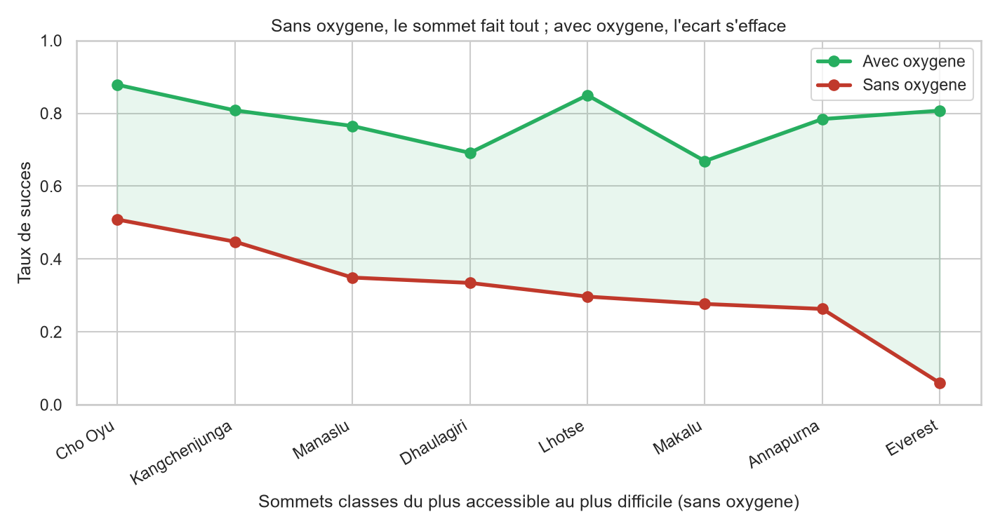
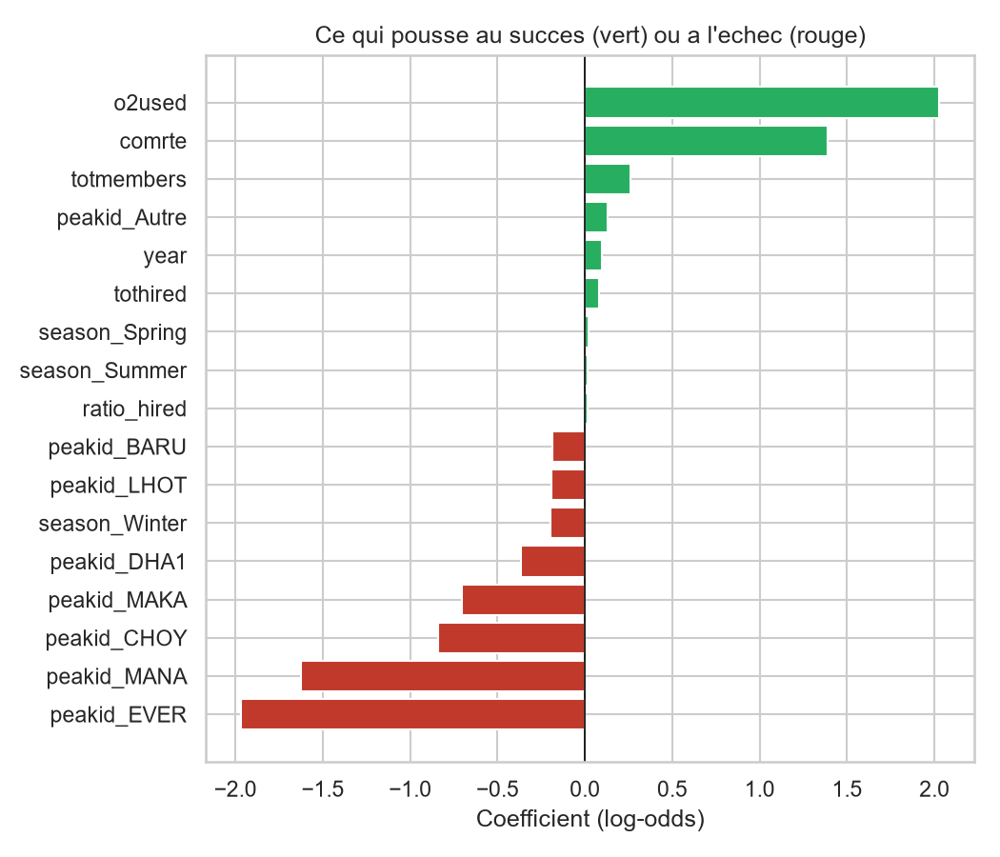

# 🏔️ Himalayan Expedition Success

[](https://github.com/BnRomain/himalayan-expedition-success/actions/workflows/ci.yml)
[](https://github.com/BnRomain/himalayan-expedition-success/actions/workflows/github-code-scanning/codeql)
[](https://github.com/BnRomain/himalayan-expedition-success/releases)
[](LICENSE)


Can we predict whether a Himalayan expedition will reach the summit, using only what is known **before it leaves**?

This project answers the question with a **logistic regression** on the 11,425 expeditions of the *Himalayan Expeditions* dataset (Kaggle, from The Himalayan Database of Elizabeth Hawley). The model reaches **69.3 %** of accuracy in cross-validation against a 55 % baseline, and its coefficients tell a clear story: **supplemental oxygen** matters most, then a **commercial route**, then the **difficulty of the peak**. The project is as much about the two traps it avoids, **data leakage** and **confounding**, as about the score.

| Context | Authors | Instructor |
| --- | --- | --- |
| Introduction to Data Processing, one-week Kaggle project (MAM3), June 2026, Polytech Nice Sophia (Université Côte d'Azur) | Romain Ben, Loriziano Soave | Lionel Fillatre |

## 📸 Preview

| Without oxygen the peak decides, with oxygen the gap closes | What pushes towards success (green) or failure (red) |
| --- | --- |
|  |  |

## 🎯 The Problem

An expedition agency, an insurer or an expedition leader would like to estimate their chances in advance, while the team, the equipment and the strategy can still be adjusted. The target, `success` (summit reached or not), is almost balanced (55 % / 45 %), so the accuracy is a fair metric and a model must beat 55 % to be useful.

The central constraint is **data leakage**: many columns of the dataset describe what happened *during* or *after* the expedition (members who summited, deaths, summit date, total days, reason for termination). Using them would predict the result with the result. They are all excluded, including `camps`, the number of high camps: on Everest the success rate jumps from 22 % with 2 camps to 71 % with 3, because the final push starts from camp 4. That variable measures how high the expedition climbed, not how well it prepared.

## 🛠️ How It Works

The pipeline is five numbered scripts, one per step of the course, to run in order from the repository root:

| Script | Step | What it does |
| --- | --- | --- |
| `src/01_exploration.py` | Exploration | Reduces the 65 raw columns to the 20 variables of a reference Kaggle notebook, flags the leaking ones, measures the signal of each candidate (success rate per category, means per class) and selects 8 predictors |
| `src/02_wrangling.py` | Wrangling | Removes the 2 expeditions with an unknown season and the 63 without any member (11,362 remain), encodes the booleans, creates `ratio_hired`, keeps the 8 most attempted peaks plus "Other" and one-hot encodes `season` and `peakid`. Writes `data/exped_clean.csv` |
| `src/03_visualisation.py` | Visualisation | Five figures that each carry one message: the effect of oxygen, the apparent oxygen and season interaction, the Sherpas versus team size heatmap, the correlation matrix and the oxygen versus peak curves |
| `src/04_feature_engineering.py` | Handcrafted features | Three features, each tested against the data before a decision: `ratio_hired` (kept), `o2used x season` (rejected: confounded by the peak) and `rope_bool` (rejected: no signal) |
| `src/05_regression.py` | Model | A `Pipeline` with the `StandardScaler` inside (no leakage into the test set), holdout versus 5-fold cross-validation, `GridSearchCV` on the regularization $C$ on the training set only, confusion matrix and coefficients |

The predictors known before departure are `o2used`, `comrte` (commercial route), `tothired` (hired staff), `totmembers`, `year`, `ratio_hired` (hired staff per member), `season` and `peakid`.

### The two traps

- **Confounding.** The oxygen effect looked much stronger in spring (+46 points) than in winter. But oxygen is used on 76 % of Everest expeditions, 88 % of which take place in spring: the "spring + oxygen" category is 68 % Everest. The season does not modulate oxygen, the peak does, and `peakid` already carries it. The interaction feature was rejected.
- **Collinearity.** `ratio_hired` had a clear univariate signal (49 % of success below 0.5, 64 % between 0.5 and 1) but its coefficient collapses to +0.02 once `o2used` and `comrte` are in the model: well-supported expeditions are also the ones that take oxygen and go through an agency.

## 📊 Results

Accuracy on the target `success`, from the [report](docs/report-fr.pdf) and reproduced by the `pipeline` job of the CI:

| Evaluation | Accuracy |
| --- | --- |
| Baseline (majority class) | 55.0 % |
| Holdout (80 / 20 split) | 69.7 % |
| **5-fold cross-validation** | **69.3 % ± 1.1 %** |
| Tuned model ($C = 3$), same holdout set | 69.6 % |

The holdout score falls inside the cross-validation interval: the performance owes nothing to a lucky split. Tuning the regularization brings nothing on a model that is already well posed. In cross-validation the precision is 75 %, the recall 66 % and the ROC-AUC 0.747.

| Coefficient (log-odds, standardized inputs) | Value |
| --- | --- |
| `o2used` (supplemental oxygen) | +2.03 |
| `comrte` (commercial route) | +1.39 |
| `totmembers` | +0.26 |
| `ratio_hired` | +0.02 |
| `peakid_MANA` (Manaslu, relative to Ama Dablam) | −1.63 |
| `peakid_EVER` (Everest, relative to Ama Dablam) | −1.97 |

## 🚀 Getting Started

Requires Python 3.12. The dataset is included in the repository (`data/exped.csv`, 5.8 MB).

```bash
git clone https://github.com/BnRomain/himalayan-expedition-success.git
cd himalayan-expedition-success
python -m venv .venv
source .venv/bin/activate          # Windows: .venv\Scripts\activate
pip install -r requirements.txt

python src/01_exploration.py
python src/02_wrangling.py         # writes data/exped_depart.csv and data/exped_clean.csv
python src/03_visualisation.py
python src/04_feature_engineering.py
python src/05_regression.py        # needs data/exped_clean.csv
```

The whole pipeline runs in under a minute. The figures are written to `docs/figures/`, the intermediate datasets to `data/` (ignored by Git, regenerated by the second script).

## 🗂️ Repository Structure

```text
himalayan-expedition-success/
├── src/
│   ├── 01_exploration.py         column selection, leakage analysis, signal of each candidate
│   ├── 02_wrangling.py           cleaning and encoding, writes data/exped_clean.csv
│   ├── 03_visualisation.py       the five figures of the analysis
│   ├── 04_feature_engineering.py three handcrafted features, tested then kept or rejected
│   └── 05_regression.py          logistic regression, validation, tuning, coefficients
├── tests/                        end-to-end pytest tests of the five scripts
├── data/
│   └── exped.csv                 Himalayan Expeditions dataset (Kaggle)
├── docs/
│   ├── figures/                  figures generated by the scripts
│   ├── report-fr.pdf, .tex       report (French)
│   ├── slides-fr.pptx            the five slides of the defence (French)
│   └── talk-script-fr.md         talk script, slide by slide (French)
├── .github/                      workflows, issue and pull request templates, Dependabot
├── requirements.txt              dependencies (pinned versions)
├── requirements-dev.txt          test and lint dependencies
├── pyproject.toml                Ruff, pytest and coverage configuration
├── CITATION.cff                  citation metadata
├── CODE_OF_CONDUCT.md            code of conduct
├── CONTRIBUTING.md               contributing guide
├── LICENSE                       MIT License
└── SECURITY.md                   security policy
```

## ✅ Tests and Quality

On every pull request and every push to `main`, GitHub Actions runs:

- **python**: Ruff lint and format check, then `pytest` runs the five scripts end to end and checks their outputs (row counts, columns, figures, accuracy above the baseline, sign and size of the coefficients), with a coverage report (the CI fails below 90 %);
- **pipeline**: the five scripts in order on `data/exped.csv`, with the scores in the job summary and the figures as an artifact;
- **docs**: markdownlint, then lychee checks the links, heading anchors and images of the Markdown files;
- **Dependency review**: blocks a pull request that adds a vulnerable dependency;
- **CodeQL**: security analysis of the Python code and the workflows.

The `main` branch is protected: every change goes through a pull request and can only be merged once these checks pass. Secret scanning with push protection blocks any committed credential.

Versions follow [Semantic Versioning](https://semver.org/) and are published as [GitHub releases](https://github.com/BnRomain/himalayan-expedition-success/releases): see the [contributing guide](CONTRIBUTING.md#versioning-and-releases).

**Dependabot** monitors the Python dependencies and the GitHub Actions. Patch and minor updates are merged automatically once the required checks of `main` have passed. See also the [security policy](SECURITY.md) and the [wiki](https://github.com/BnRomain/himalayan-expedition-success/wiki).

## 📄 Report, Slides and Talk Script

The deliverables of the project are in French:

- **📑 Report** (business goal, team management, wrangling, visualisation, handcrafted features, regression, conclusion): [read the report](docs/report-fr.pdf) (source: [`docs/report-fr.tex`](docs/report-fr.tex))
- **📊 Slides** of the 5-minute data storytelling defence: [`docs/slides-fr.pptx`](docs/slides-fr.pptx)
- **🎤 Talk script**, slide by slide for both speakers, with the answers prepared for the jury: [read the script](docs/talk-script-fr.md)

## 🙏 Acknowledgments

- The [Himalayan Expeditions](https://www.kaggle.com/datasets/siddharth0935/himalayan-expeditions) dataset on Kaggle, derived from [The Himalayan Database](https://www.himalayandatabase.com/), the expedition archives of Elizabeth Hawley. The Kaggle page gives the terms of use of the data.
- The notebook [Himalayan Climb Prediction with ML/DL](https://www.kaggle.com/code/muhammedaliyilmazz/himalayan-climb-prediction-with-ml-dl) by Muhammed Ali Yilmaz, whose selection of 20 variables was the starting point of the exploration.
- Lionel Fillatre, for the course and the project.

## 🤝 Contributing

Contributions are welcome. Please read the [contributing guide](CONTRIBUTING.md) and the [code of conduct](CODE_OF_CONDUCT.md) before opening an issue or a pull request. Security vulnerabilities must be reported privately, as described in the [security policy](SECURITY.md).

## 📜 License

The code and the documentation are released under the [MIT License](LICENSE). The dataset in `data/` keeps the terms of its Kaggle page and of The Himalayan Database, see [Acknowledgments](#-acknowledgments).

## 📚 Citation

To cite this project, use the metadata in [`CITATION.cff`](CITATION.cff) or the "Cite this repository" button on GitHub.
